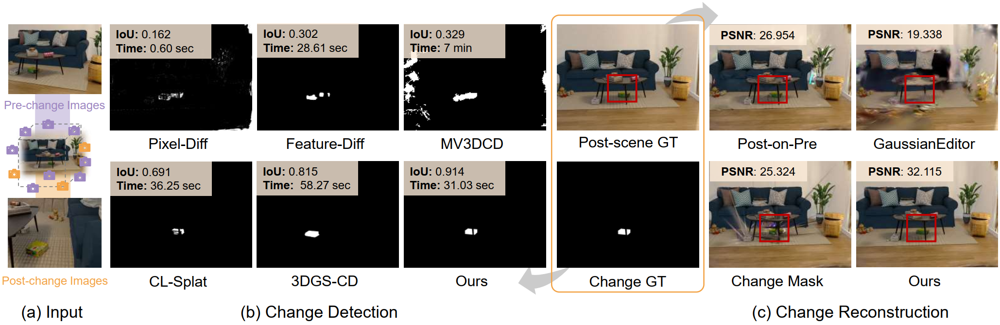
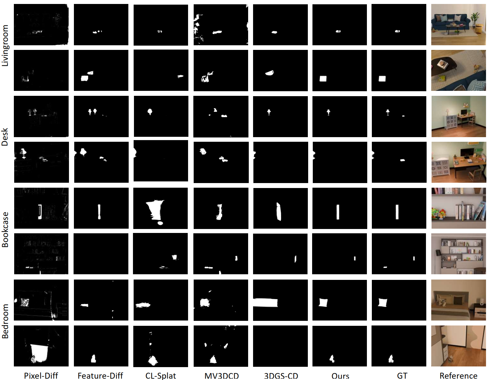

<h2 align="center">
  <b>SCAR-3D: 3D Scene Change Modeling with Consistent Multi-View Aggregation</b>
  <br>
  <b><i>3DV 2026 Submission #332</i></b>
</h2>

<p align="center">
    <!-- Zirui Zhou, Junfeng Ni, Shujie Zhang, Yixin Chen, Siyuan Huang -->
    Anonymous Authors
</p>

<p align="center">
    <a href='#'>
        
    </a>
    <a href='#'>
        
    </a>
    <a href='#'>
        
    </a>
</p>

<p align="center">
    
</p>

SCAR-3D is a novel 3D scene change detection and reconstruction framework that identifies object-level changes from dense pre-change and sparse post-view images. It leverages a signed-distance-based 2D differencing module, multi-view aggregation with voting and pruning, and segmentation validation to produce accurate and consistent 3D change masks. The method also supports continual scene reconstruction by selectively updating dynamic regions.

---

## 🌟Features

- **Multi-view Consistent Change Detection**: Aggregates 2D differences into a unified 3D representation with voting and pruning.
- **Signed-Distance-Based Localization**: Captures directional changes in feature space for robust detection.
- **Segmentation Validation**: Uses EfficientSAM to refine change masks and improve accuracy.
- **Continual Reconstruction**: Updates only changed regions to maintain scene consistency and reduce artifacts.
- **Synthetic Dataset (CCS3D)**: Provides editable indoor scenes with diverse change types for controlled evaluation.

---

## 🔨 Installation


#### Prerequisites
- CUDA 12.4 or higher
- Python 3.8
- Conda (recommended)

#### Step 1: Clone the Repository
```bash
git clone https://github.com/zr-zhou0o0/SCaR-3D.git
cd SCaR-3D
```

#### Step 2: Create Conda Environment
```bash
conda create -n scar3d python=3.8 -y
conda activate scar3d
```

#### Step 3: Install PyTorch and CUDA Dependencies
```bash
pip install torch==2.4.1 torchvision torchaudio --index-url https://download.pytorch.org/whl/cu124
```

#### Step 4: Install Other Dependencies
```bash
pip install -r requirements.txt
```

#### Step 5: Install Other Required Packages from Source
```bash
pip install git+https://github.com/yformer/EfficientSAM.git@c9408a74b1db85e7831977c66e9462c6f4891729

pip install git+https://github.com/camenduru/simple-knn.git

pip install git+https://github.com/rahul-goel/fused-ssim.git

pip install submodules/diff-point-rasterization

```

## 📦 Pretrained Weights

---

## 📊 Dataset

### CCS3D (Controllable Change in 3D Scenes)
A synthetic dataset built with Blender, featuring four complex indoor scenes:
- `Desk`
- `Bookcase`
- `Livingroom`
- `Bedroom`


Each scene supports:
- Multiple change types: insertion, removal, translation, rotation, mixed.
- Complex camera trajectories simulating real-world navigation.
- Fine-grained object-level annotations.

Download the CCS3D dataset [here](#).

### 3DGS-CD 
Our processed 3DGS-CD dataset can be downloaded [here](#).

### Customized Datasets

#### Dataset Creation

```bash
# Coming Soon
```

---

## 💡Usage

### Change Detection
```bash
# Example command (to be updated)
python detect_changes.py \
    --pre_images path/to/pre_change \
    --post_images path/to/post_change \
    --output path/to/masks
```

### Continual Reconstruction
```bash
# Example command (to be updated)
python reconstruct.py \
    --pre_model path/to/pre_change_gs \
    --post_images path/to/post_change \
    --change_masks path/to/masks \
    --output path/to/post_change_gs
```

---
<!-- 
## Results

### Quantitative Change Detection Results on CCS3D Dataset

| Method    | Livingroom F1 | Livingroom IoU | Bookcase F1 | Bookcase IoU | Desk F1 | Desk IoU | Bedroom F1 | Bedroom IoU | Average F1 | Average IoU |
|-----------|---------------|----------------|-------------|--------------|---------|----------|------------|-------------|------------|-------------|
| PixDif    | 0.273         | 0.162          | 0.398       | 0.254        | 0.315   | 0.201    | 0.286      | 0.176       | 0.318      | 0.198       |
| FeatDif   | 0.420         | 0.302          | 0.480       | 0.323        | 0.320   | 0.256    | 0.705      | 0.584       | 0.450      | 0.343       |
| CL-Splat  | 0.789         | 0.657          | 0.567       | 0.399        | 0.294   | 0.199    | 0.501      | 0.341       | 0.538      | 0.399       |
| MV3DCD    | 0.478         | 0.329          | 0.291       | 0.178        | 0.449   | 0.295    | 0.547      | 0.413       | 0.441      | 0.304       |
| 3DGS-CD   | 0.897         | 0.815          | 0.525       | 0.408        | 0.477   | 0.353    | 0.148      | 0.089       | 0.512      | 0.416       |
| **Ours**  | **0.955**     | **0.914**      | **0.610**   | **0.477**    | 0.423   | **0.377**| **0.909**  | **0.834**   | **0.724**  | **0.650**   |

*Note: Best results are highlighted in bold. Our method achieves state-of-the-art performance on most scenes and overall average metrics.* -->

### Qualitative Examples

<p align="center">
    
</p>

---

## Citation

TBD

<!-- ```bibtex
@inproceedings{anonymous2026scar3d,
  title={SCAR-3D: 3D Scene Change Modeling with Consistent Multi-View Aggregation},
  author={Anonymous},
  booktitle={International Conference on 3D Vision (3DV)},
  year={2026}
}
``` -->

---

<!-- ## Acknowledgements -->

<!-- This work was supported by anonymous institutions. -->
 <!-- We thank the authors of 3DGS, EfficientSAM, COLMAP, and Blender for their open-source contributions. -->

<!-- --- -->
<!-- **Note**: This is a confidential submission to 3DV 2026. Code and data will be released upon acceptance. -->


